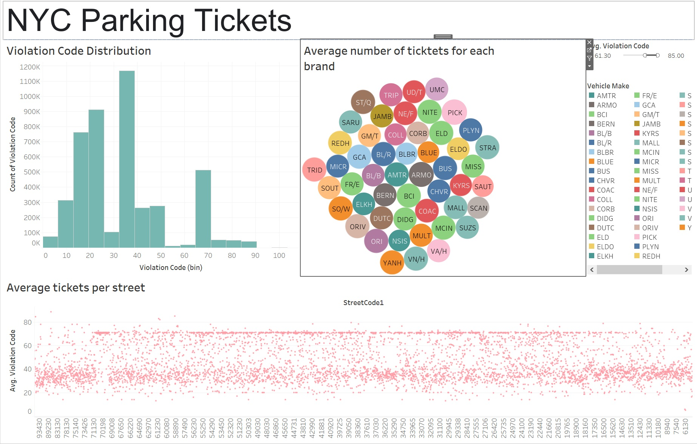

# EntregaBigData

En este repositorio se encuentra la solucion a la evidencia del Modulo de Big Data.
Dentro del jupyter notebook "Entrega A01231973" Se encuentra el codigo. Asi mismo dentro del archivo Dashboard se encuentra el Dashboard realizado dentro de Tableau

El dataset se obtuvo del siguente link: https://www.kaggle.com/datasets/new-york-city/nyc-parking-tickets

### Imagen del tablero de Tableau:

